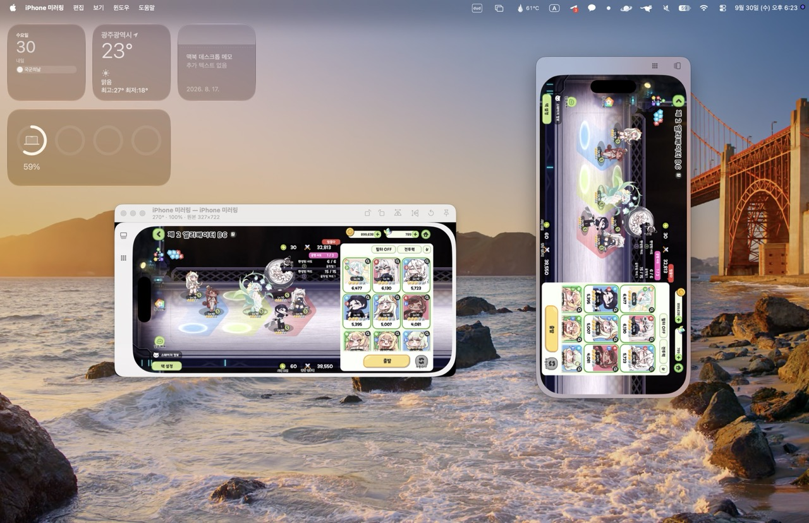

# Rotatorring

  

A desktop app that shows a live, rotated or flipped view of a window you pick.

## Layout and shared core

```text
core/                Portable C11 library, public header, CMake build and C tests
bindings/dotnet/      C ABI declarations and thin C# value wrappers
apps/macos/          Swift/AppKit app and macOS resources
apps/windows/        C#/Windows Forms app
tests/               Swift, .NET interop and Windows desktop tests
scripts/             Platform and C core build scripts
```

Both apps use `core/include/rotatorring_core.h` for orientation normalization,
rotation and flips, forward/inverse coordinate mapping, centered rendering
matrices, displayed sizes, aspect fitting and zoom capped to the available screen.
The library is stateless and allocation-free. Capture, input dispatch, menus and rendering APIs stay in each
platform app. Swift Package Manager compiles the C source directly into the
macOS executable; .NET calls the same source's shared library through P/Invoke.
Shared geometry changes belong in the C core.

## Windows

Requires Windows 10 22H2 or Windows 11. Install the [.NET 10 SDK](https://dotnet.microsoft.com/download/dotnet/10.0)
to build, plus CMake 3.20+ and Visual Studio 2022 **Desktop development with C++**
(MSVC v143). ARM64 publishing additionally requires the **C++ ARM64 build tools**.
The .NET build automatically compiles the C core and includes its DLL in the
output; published executables bundle it with the runtime.

From PowerShell in the project directory:

```powershell
.\scripts\build-windows.ps1
.\build\windows\win-x64\Rotatorring.exe
```

For Windows on ARM:

```powershell
.\scripts\build-windows.ps1 -Runtime win-arm64
.\build\windows\win-arm64\Rotatorring.exe
```

For development, use `dotnet run --project apps/windows/Rotatorring`.
Select a window and double-click, press Enter, or click **미러 열기**.
Use **새로 고침** to refresh the list. The picker stays open to create more mirrors;
closing the picker exits the app.

- Rotate right Ctrl+R, rotate left Ctrl+L, flip horizontally Ctrl+Shift+H,
  flip vertically Ctrl+Shift+V, reset Ctrl+Shift+R.
- Actual size Ctrl+0, zoom in Ctrl+=, zoom out Ctrl+-.
- Follow source client size Ctrl+Alt+F; resizing changes zoom while following
  is enabled. With following disabled, the image fits with letterboxing.
- Always on top Ctrl+Alt+T.
- **입력 전달** toggles background input forwarding. Clicks, drags, middle/right
  buttons, wheel scrolling, text and key messages go to the source client area,
  undoing rotation and flips. Click a source control in the mirror before typing.
  App menu shortcuts take precedence over forwarded keys.

### Windows limitations

The Windows backend captures the **client area** (without the title bar) using
[PrintWindow](https://learn.microsoft.com/en-us/windows/win32/api/winuser/nf-winuser-printwindow)
on a worker thread, requesting frames approximately every 33 ms. The target app
must support this API. Some GPU-rendered, protected, game or video windows can
return black or stale images even when the call succeeds. This is not a
Windows Graphics Capture backend. Minimized windows are paused; restore the
source to resume. A closed source requires opening a new mirror.

PrintWindow is synchronous and may stall in the source app. Each mirror permits
only one outstanding capture, so its UI remains responsive without accumulating
workers. A stalled source must recover before that mirror receives more frames.

Input uses [PostMessage](https://learn.microsoft.com/en-us/windows/win32/api/winuser/nf-winuser-postmessagew)
and does not activate the source or move the cursor. Message-based input is
best effort: applications that require raw/HID input, global modifier state,
IME composition or foreground focus may ignore it. Elevated targets can reject
messages from a non-elevated mirror. A successful post does not guarantee the
source acted on it. No permission bypass or HID replay is provided.

## macOS

Requires macOS 14 or newer and Swift 6/Xcode command line tools.

```bash
./scripts/build-app.sh && open build/Rotatorring.app
```

The app icon is drawn in code: edit `scripts/make-icon.swift` and run
`swift scripts/make-icon.swift` to regenerate `apps/macos/Resources/AppIcon.icns`.

On first launch, allow Screen & System Audio Recording and Accessibility in
System Settings › Privacy & Security, then relaunch. Check both in Settings (⌘,).

Choose a window in the picker (iPhone Mirroring is preselected if it is open).
Double-click or press Return to start.

- Rotate right ⌘R, rotate left ⌘L, flip horizontally ⇧⌘H, flip vertically ⇧⌘V, reset ⇧⌘R.
- Actual size ⌘0, zoom in ⌘=, zoom out ⌘-.
- Follow source window size ⌥⌘F. Dragging the window edge changes the zoom;
  turning following off allows free resizing with letterboxing.
- Always on top ⌥⌘T. New mirror ⌘N.
- Clicks, drags, right-clicks and key presses are forwarded with rotation and
  flips undone. Private SkyLight calls focus the source without raising it or
  moving the cursor; the source can be covered. iPhone Mirroring ignores the
  public `CGEvent.postToPid` path.

## Verification

The C core builds and tests on macOS/Linux with CMake and a C11 compiler:

```sh
./scripts/build-core.sh
```

On Windows, use `./scripts/build-core.ps1` (or `-Runtime win-arm64`). Native
C tests run when the built architecture matches the host.

Swift integration tests, including the y-up layer matrix adapter:

```sh
swift test
```

The .NET interop tests run on macOS/Linux/Windows, covering all 16 rotation/flip
combinations, native struct return values, inverse input mapping and aspect fit.
They automatically build and copy the host C library (CMake/compiler required):

```sh
dotnet run --projecttests/dotnet/CoreInterop -c Release
```

Windows rendering/capture smoke tests require a Windows desktop session:

```powershell
dotnet run --projecttests/windows/Desktop -c Release
```

The shared core CI tests C and .NET interop on Linux/macOS and the Swift adapter
on macOS. The Windows CI workflow builds, tests and publishes x64 and ARM64 executables.
For manual verification, mirror a normal desktop app such as Notepad: rotate and
flip it, click/type/drag/scroll through the mirror, resize the source, minimize
and restore it, and close it. Check free resizing, multiple mirrors and always
on top. Repeat input checks with a native child control and an elevated target;
unsupported target behavior is described above.

Cross-compiling the managed Windows app on macOS/Linux with `dotnet build` is
supported for compilation checks. Cross-publishing requires a Windows C DLL
built for the same target architecture; supply
`-p:CoreNativeLibrary=/absolute/path/to/RotatorringCore.dll`, or publish on Windows.
A host dylib/so must never be packaged as a Windows DLL.
